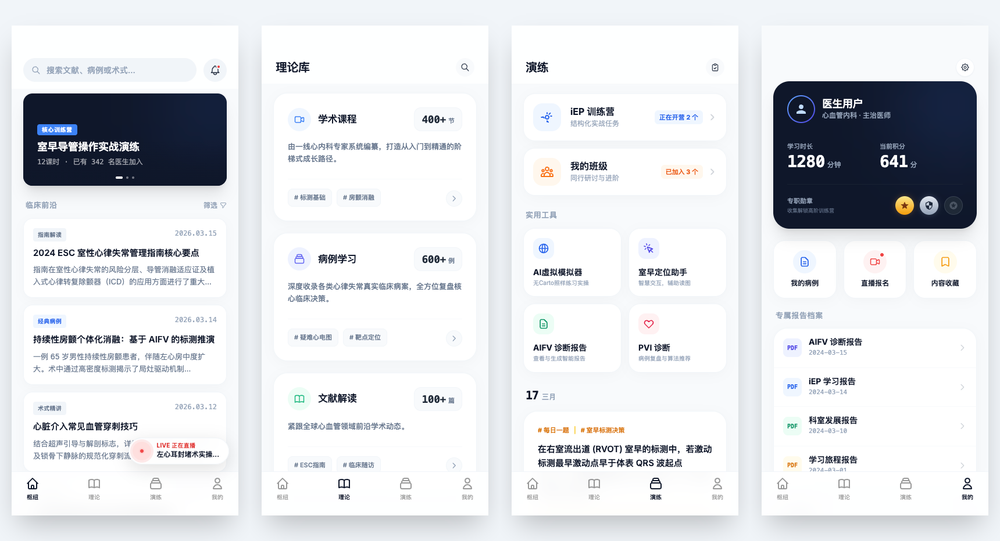
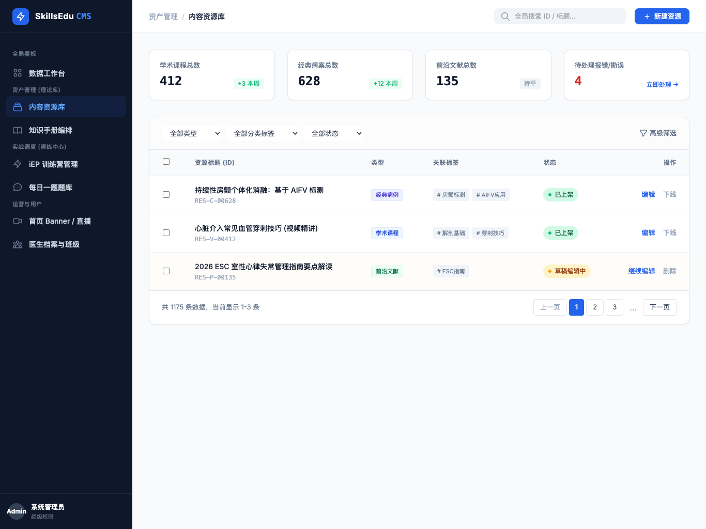

# SkillsEducation

## 1. 项目意义

本项目是一个针对「专业教育」品类的**范式概念小程序**：不面向最终用户交付完整产品，而是把「专业教育」这一品类在产品形态上该怎么拆、怎么搭，做成一套可复用的架构验证。

专业教育区别于泛知识付费：用户来不是为了消遣或缓解焦虑，而是为了在某一领域从「不会」到「会」、从「会」到「熟练」。产品若只堆课程和资讯，很难支撑「练会」这一环。本项目意在验证：用一套清晰的结构把「学」和「练」分开、再组合，能否让专业教育类产品更可理解、可扩展。

---

## 2. 解决方案：知与行的划分

核心做法是按**信息流向**区分两类场景：

- **知（理论）**：系统给答案，用户吸收。课程、病案、文献解读都属于这一类，目标是帮用户建立心智模型和知识结构。
- **行（演练）**：用户做决策、做操作，系统反馈。训练营任务、工具实操、自测与闯关属于这一类，目标是暴露盲区、形成肌肉记忆。

在架构上把「知」和「行」拆成两个独立入口，避免在一个页面里既塞课程又塞练习，导致信息混杂。用户先在理论侧把该学的学完，再在演练侧用任务和工具检验自己。

---

## 3. 电生理业务上的示例

我们以**心脏电生理（EP）医生培训**为示例业务，把上述结构落进一个小程序：学术与病例资源很多，同时又有室早定位、消融模拟等需要「动手」的场景，适合做知/行分离的演示。

下图是当前小程序在电生理场景下的四页结构示意：

- **首页**：搜索、训练营/课程轮播、临床前沿信息流、直播入口。只做发现和跳转，不承载深度学习。
- **理论库**：学术课程、病例学习、文献解读。全部是「系统给答案」的输入型内容。
- **演练**：iEP 训练营与班级任务、室早定位/AIFV 报告/PVI 等工具、每日一题。全部是「用户做选择、做操作」的输出型场景。
- **我的**：学习时长与积分、勋章、报告档案、设置。与知/行无关，只做资产与账号管理。

在电生理这个业务上，知与行的划分直接对应「先学标测与术式、再在训练营和工具里练」的路径；同一套划分方式也可以套到其他依赖「先建立心智模型、再刻意练习」的专业领域。

---

## 4. 内容与配置：由 CMS 驱动

小程序端不写死栏目与文案，首页轮播、临床前沿、理论库入口、演练工具等均由**后台 CMS** 配置下发。运营在后台维护栏目、链接、排序与上下架，小程序按配置渲染，便于多业务线复用同一套架构。

下图示意后台 CMS 的配置界面（栏目与内容管理）：

